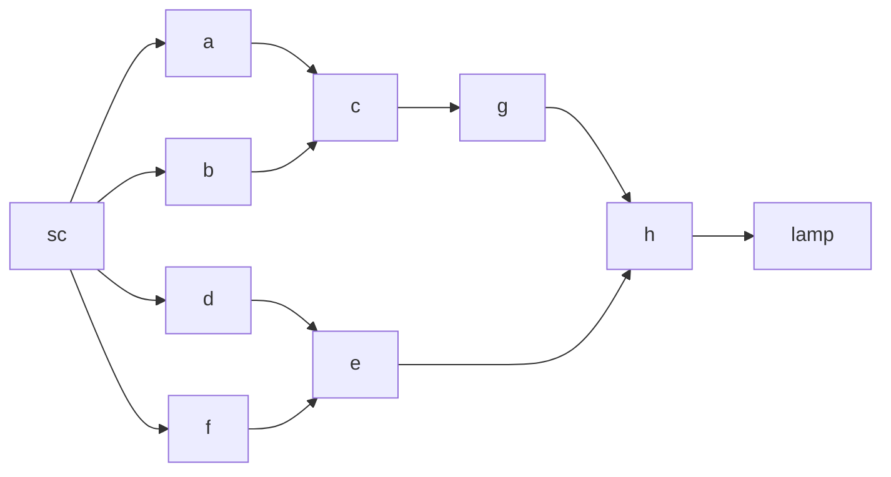

超级源点->开关->电路->灯泡
每个NodeIn和NodeOut对应一条Wire
每个NodeIn只允许一个输入

Node: 布尔 激活状态 & 属于哪个门
NodeIn: Wire from
NodeOut: Wire to
TODO SuperEnd, 改改BFS, 完善Module, Github, libJETC, 博客项目页面
Wire: Node in, out & 布尔 激活状态
Gate: 包含的In和OutNode & 更新Out方法
Router: 是个Gate，1进3出

阻塞计算函数，不阻塞渲染函数，超级源点开始，找到开关，修改开关的NodeOut状态，找到NodeIn和Wire，修改状态
找到NodeIn属于的Gate，通过Gate更新NodeOut，找到NodeIn和Wire，修改状态
......
找到灯泡的NodeIn，修改灯泡状态，完成更新，取消阻塞计算函数，渲染

更新是瞬时的
路由器

不用担心更新不一致或tick不同步导致结果不一样
因为计算函数阻塞后不会导致后续计算（下一组开关输入）开始
直到bfs队列被清空时，更新最慢的一条路也已经更新完了，再取消阻塞

即需要像assetManager一样的finish_updating函数来等待更新
